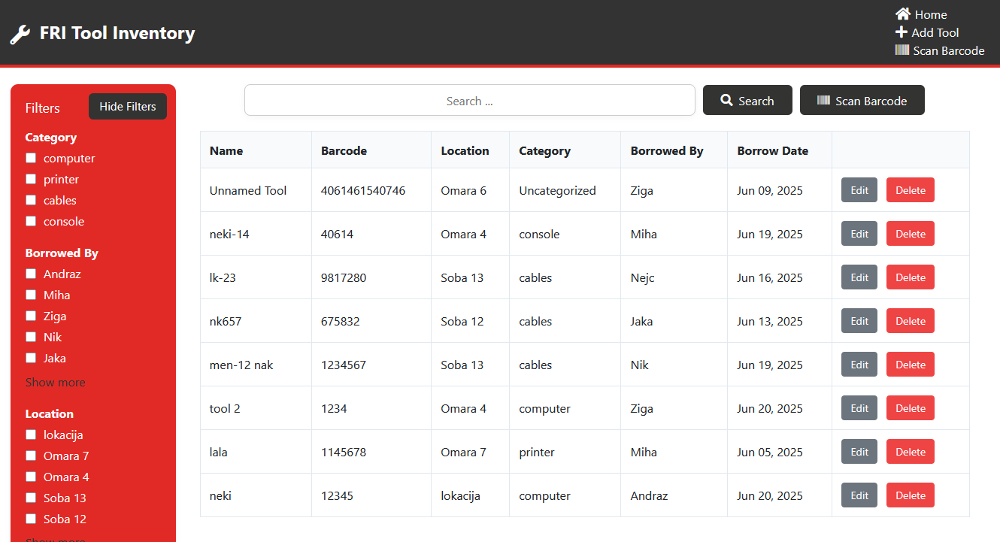
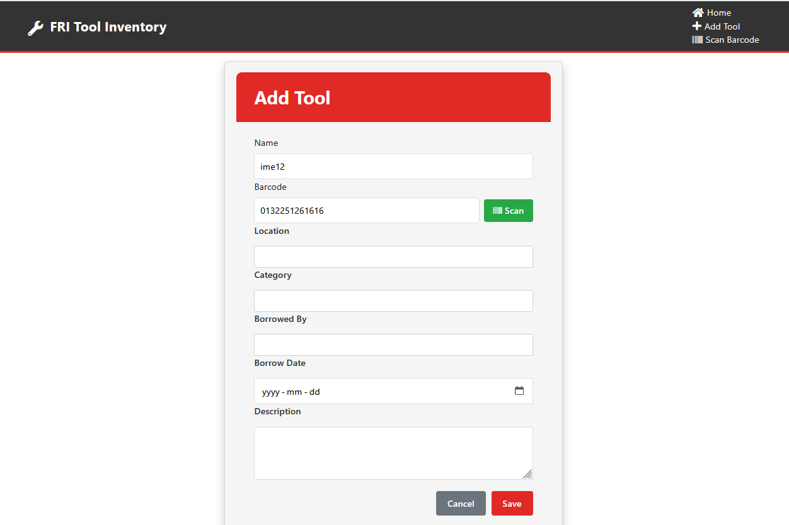
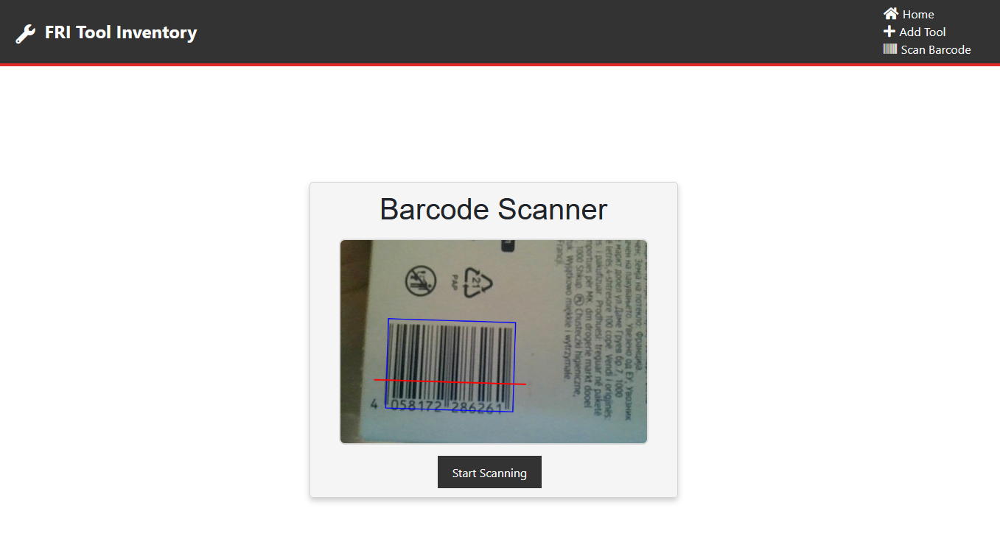
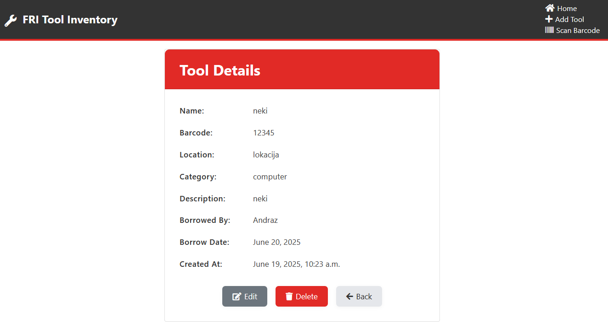

# Tool Inventory App

A  Django-based asset management system for tracking tools and equipment, featuring barcode scanning.

## Features

   
- **Add, edit, and delete tools** with fields for name, barcode, location, category, description, borrowed by, and borrow date.
  

- **Barcode scanning** using your device’s camera (QuaggaJS) or manual entry.
  
  
- **Filtering** by category, location, borrowed by, and borrow date (with multi-select).
  

## Getting Started

1. **Clone the repository:**
   ```sh
   git clone https://github.com/emacrne/RVP.git
   cd inventory_app
   ```

2. **Install dependencies:**
   ```sh
   python -m venv venv
   # On Unix/macOS:
   source venv/bin/activate
   # On Windows:
   venv\Scripts\activate
   pip install -r requirements.txt
   ```

3. **Apply migrations:**
   ```sh
   python manage.py makemigrations
   python manage.py migrate
   ```

4. **Run the development server:**
   ```sh
   python manage.py runserver
   ```

5. **Access the app:**
   Open [http://127.0.0.1:8000/](http://127.0.0.1:8000/) in your browser.


## Tech Stack

- **Backend:** Django 
- **Frontend:** Bootstrap, DataTables, Font Awesome, QuaggaJS (for barcode scanning)
- **Database:** SQLite


### Attribution

The code for the barcode scanner is based on [michelhaj/asset_management_app](https://github.com/michelhaj/asset_management_app.git).

